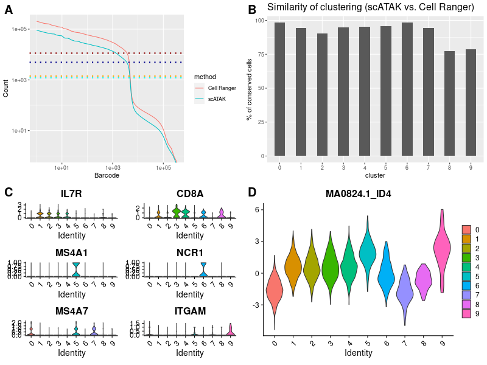
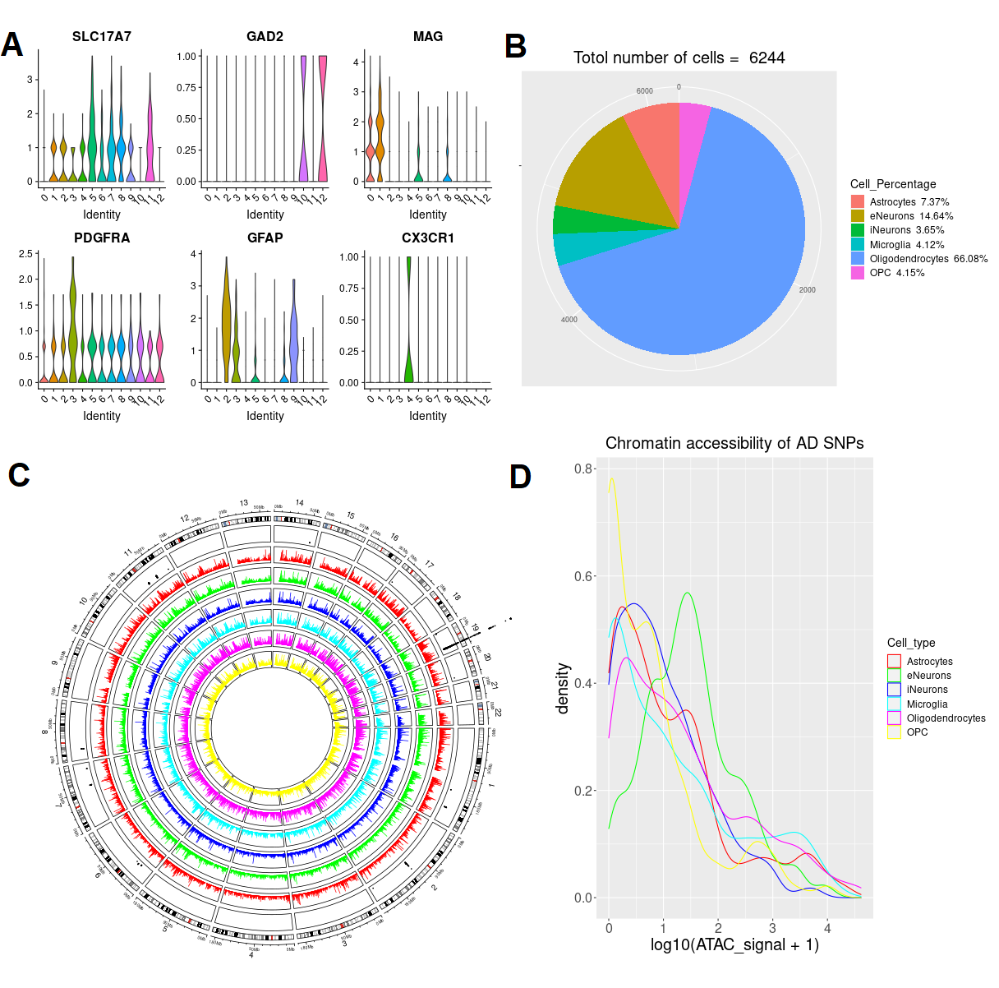
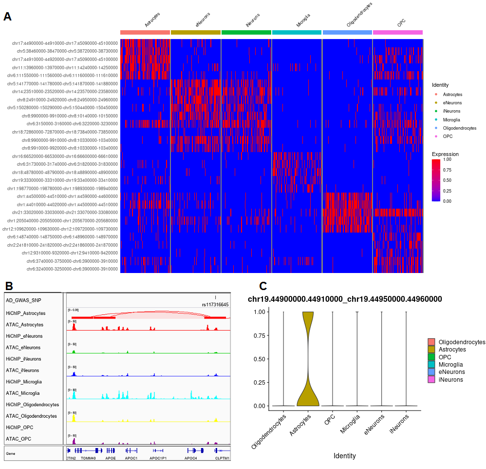

### GP_2021_4
#####
#### This repository contains the code to generate the scATAK preprint figures.
##### PBMC scATAC-seq benchmarking results [See details](PBMC/README.md)
##### Figure2

####
####
#####
##### Human hippocampus scATAC-seq results [See details](HBRAIN/README.md)
##### Figure3

#####
##### Figure4

####
